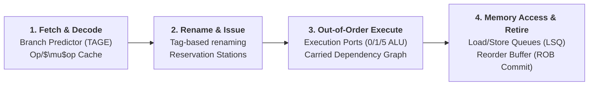

# ⚡ CPU Performance Engineering: Primary Sources & Systems Catalog

A curated, primary-source engineering reference catalog synthesized from [`cpu-performance-engineering`](file:///home/ahmed/personal/cpu-performance-engineering), anchoring all vector retrieval algorithms, SIMD kernels, cache layouts, and hardware measurements across `secan` and `cennan` directly to vendor specifications, seminal papers, and empirical benchmarks.

---

## 🧭 1. Foundational Systems & Hardware Canon

| Resource | Author / Source | Key Focus & Systems Vocabulary |
| :--- | :--- | :--- |
| **[Computer Architecture: A Quantitative Approach (6th/7th ed)](https://shop.elsevier.com/books/computer-architecture/hennessy/978-0-443-15406-5)** | John L. Hennessy & David A. Patterson | Pipelining, memory hierarchy, cache coherence, out-of-order execution, speculation, vector architectures. |
| **[Optimizing Software in C++](https://www.agner.org/optimize/optimizing_cpp.pdf)** | Agner Fog | Mapping high-level C++ constructs to pipeline mechanisms; identifying loop-carried dependency bottlenecks over raw instruction counts. |
| **[Intel 64 and IA-32 Architectures Optimization Reference Manual](https://www.intel.com/content/www/us/en/content-details/671488/intel-64-and-ia-32-architectures-optimization-reference-manual-volume-1.html)** | Intel Corporation | Microarchitectural pipeline rules, port contention (Ports 0/1/5 ALU, Ports 2/3 Loads, Ports 4/7 Stores), VNNI/AMX intrinsics. |
| **[Software Optimization Guide for AMD Zen 4 / Zen 5 Microarchitectures](https://docs.amd.com/v/u/en-US/58455_1.00)** | AMD | Op cache feed rates, macro-fusion rules, dual 256-bit vs 512-bit vector pipelines, latency/throughput tables. |
| **[What Every Programmer Should Know About Memory](https://www.akkadia.org/drepper/cpumemory.pdf)** | Ulrich Drepper | Multi-level cache access steps, page walks, TLB misses, hardware prefetchers, NUMA access penalties. |
| **[Memory Barriers: A Hardware View for Software Hackers](http://www.rdrop.com/users/paulmck/scalability/paper/whymb.2010.07.23a.pdf)** | Paul E. McKenney | Store buffers, invalidate queues, MESI/MOESI cache coherence protocols, sequential consistency vs relaxed memory ordering. |
| **[Systems Performance: Enterprise and the Cloud (2nd ed)](https://www.brendangregg.com/systems-performance-2nd-edition-book.html)** | Brendan Gregg | USE method, PMU hardware counter profiling, IPC/CPI analysis, cache miss metrics, flame graphs. |
| **[Roofline: An Insightful Visual Performance Model for Multicore Architectures](https://cacm.acm.org/research/roofline-an-insightful-visual-performance-model-for-multicore-architectures/)** | Samuel Williams, Andrew Waterman, David Patterson | Arithmetic intensity ($\text{FLOPs/Byte}$), memory bandwidth bounds vs compute saturation roofs. |
| **[A Top-Down Method for Performance Analysis and Counters Architecture](https://sites.google.com/site/analysismethods/yasin-pubs)** | Ahmad Yasin (Intel) | Top-Down Microarchitecture Analysis (TMA): Front-End Bound, Bad Speculation, Back-End Bound (Core vs Memory), Retiring. |
| **[Performance Analysis and Tuning on Modern CPUs](https://github.com/dendibakh/perf-book)** | Denis Bakhvalov | Systematic workflow from noisy timings to hardware counters, TMA bottlenecks, and compiler optimization analysis. |

---

## 🔬 2. Microarchitecture & Instruction Lifecycle



### Key Primary Papers:
* **Fetch & Decoded $\mu$op Cache**:
  * *Fetch Directed Instruction Prefetching* (Glenn et al., MICRO 1999)
  * *Micro-Operation Cache: A Power Aware Frontend for Variable Instruction Length ISA* (Solomon et al., ISLPED 2001)
* **Out-of-Order Issue & Critical Paths**:
  * *An Efficient Algorithm for Exploiting Multiple Arithmetic Units* (Robert Tomasulo, IBM 1967)
  * *Focusing Processor Policies via Critical-Path Prediction* (Tune et al., ISCA 2001)
  * *Measuring Reorder Buffer Capacity* (Henry Wong, Stuffed Cow)
* **Memory Dependence & Disambiguation**:
  * *Memory Dependence Prediction using Store Sets* (Chrysos & Emer, ISCA 1998)
  * *Implementing Precise Interrupts in Pipelined Processors* (Smith & Pleszkun, IEEE Trans. Computers 1988)

---

## 💾 3. Memory Hierarchy, Bandwidth & Cache Coherence

### Cache Latency & Geometry Rules of Thumb (x86_64 Server):
* **L1 Data Cache**: $32\text{–}48\text{ KB}$, 8-way associative, 4–5 cycles latency.
* **L2 Cache**: $1\text{–}2\text{ MB}$ per core, 8–16-way associative, 12–14 cycles latency.
* **L3 / Last Level Cache (LLC)**: $2\text{–}4\text{ MB}$ per core shared slice, 40–60 cycles latency.
* **Main Memory (DDR4/DDR5)**: $60\text{–}90\text{ ns}$ ($200\text{–}350\text{ cycles}$).

### Core Memory Engineering References:
* **Cache Line Alignment**: Every vector buffer must align to 64-byte boundaries (`alignas(64)`) to eliminate split-load penalties and avoid false sharing across cores.
* **Memory Level Parallelism (MLP)**: *Microarchitecture Optimizations for Exploiting Memory-Level Parallelism* (Chou et al., ISCA 2004) — saturating Miss Status Holding Registers (MSHRs) via non-blocking loads.
* **First-Touch Allocation**: *NUMA Memory Management in Linux* — ensuring threads that execute the SIMD distance scan allocate local NUMA node pages.

---

## 🏎️ 4. SIMD Kernels, Quantization & Inference on CPU

* **AoS vs SoA (Array of Structures vs Structure of Arrays)**:
  * Packed vector layouts must store contiguous dimensions or quantized codes in cache-line chunks, avoiding strided gathers.
* **Integer Arithmetic & Saturated SIMD**:
  * `_mm256_subs_epu8`: Saturated unsigned 8-bit difference.
  * `_mm256_maddubs_epi16`: Unsigned $\times$ signed 8-bit multiply with horizontal pairwise 16-bit add.
  * `_mm256_madd_epi16`: Signed 16-bit multiply with horizontal 32-bit accumulate.
  * `_mm256_dpbusd_epi32` (AVX-VNNI): Direct 4-way int8 dot product into int32.
* **Batch GEMM Cache Blocking**:
  * $K$-way loop unrolling across 4 to 8 parallel accumulator registers (`__m256` / `__m512`) to saturate FMA execution ports and break latency chains.
  * 2D register blocking ($4 \times 16$ or $6 \times 16$) keeping micro-tiles resident in registers.

---

## 🧪 5. Reproducible Benchmark Catalog (`misc/benchmarks/`)

The [`cpu-performance-engineering/misc/benchmarks/`](file:///home/ahmed/personal/cpu-performance-engineering/misc/benchmarks) directory contains 14 runnable C reference benchmarks:

| Benchmark | Directory | Key Systems Phenomenon Measured |
| :--- | :--- | :--- |
| **02** | `02-branch-misprediction` | Cost of branch misprediction: sorted vs unsorted vs branchless code paths. |
| **03** | `03-latency-vs-throughput` | Instruction latency vs pipeline reciprocal throughput (FMA port saturation). |
| **04** | `04-cache-latency` | Pointer-chasing latency steps across L1D, L2, L3, and main memory boundaries. |
| **05** | `05-measurement-pitfalls` | RDTSC timing skew, frequency scaling, and warm-up effects in microbenchmarks. |
| **06** | `06-roofline` | Empirical arithmetic intensity vs DRAM/cache bandwidth ceilings. |
| **07** | `07-aos-vs-soa-simd` | Cache-line utilization: SIMD contiguous loads (SoA) vs strided gathers (AoS). |
| **08** | `08-autovectorization-aliasing` | Pointer aliasing hazards (`restrict` keyword) preventing auto-vectorization. |
| **09** | `09-false-sharing` | Multithreaded performance collapse when distinct threads write to the same 64B cache line. |
| **10** | `10-first-touch` | Remote vs local NUMA node page allocation latencies under Linux. |
| **11** | `11-syscall-cost` | Context switch overhead, Meltdown/Spectre mitigations (KPTI), and `io_uring` gain. |
| **12** | `12-coordinated-omission` | High-percentile ($p99/p99.9$) latency distortions in blocking request generators. |
| **13** | `13-sgemm-naive-vs-blas` | Naive $O(N^3)$ loops vs cache-blocked tiled OpenBLAS/MKL GEMM kernels. |
| **14** | `14-pcore-vs-ecore` | Architectural throughput differences across hybrid performance and efficiency cores. |
| **15** | `15-stream-bandwidth` | Sustained STREAM memory bandwidth under Copy, Scale, Add, and Triad kernels. |

---

## 🔌 6. Local MCP Performance Brain (`cpu-perf`)

The repository includes a ready-to-run Model Context Protocol (MCP) server under [`misc/mcp/`](file:///home/ahmed/personal/cpu-performance-engineering/misc/mcp):

```bash
# Add to Claude Code
claude mcp add --scope user cpu-perf -- uvx --from /home/ahmed/personal/cpu-performance-engineering/misc/mcp cpu-perf

# Add to Codex CLI
codex mcp add cpu-perf -- uvx --from /home/ahmed/personal/cpu-performance-engineering/misc/mcp cpu-perf
```
